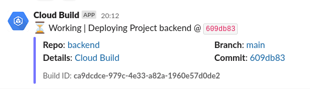
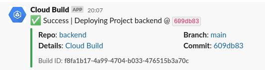

# Slack Cloudbuild

`slack-cloudbuild` is a Google Cloud Function sending Cloud Build statuses to a Slack channel

Adapted from https://github.com/onsails/cloudbuild-slack

This bot uses the Slack SDK to alert for Google CloudBuilds

It updates previous messages for the build so it doesn't flood the channel with messages

Run with:

```
ALERT_CHANNEL=<slack_channel_name> GITHUB_ORG=<github_org_name> ./deploy.sh
```

After the first run, add your `BOT_TOKEN` and `USER_TOKEN` secrets to the function and redeploy it.


## Demo




